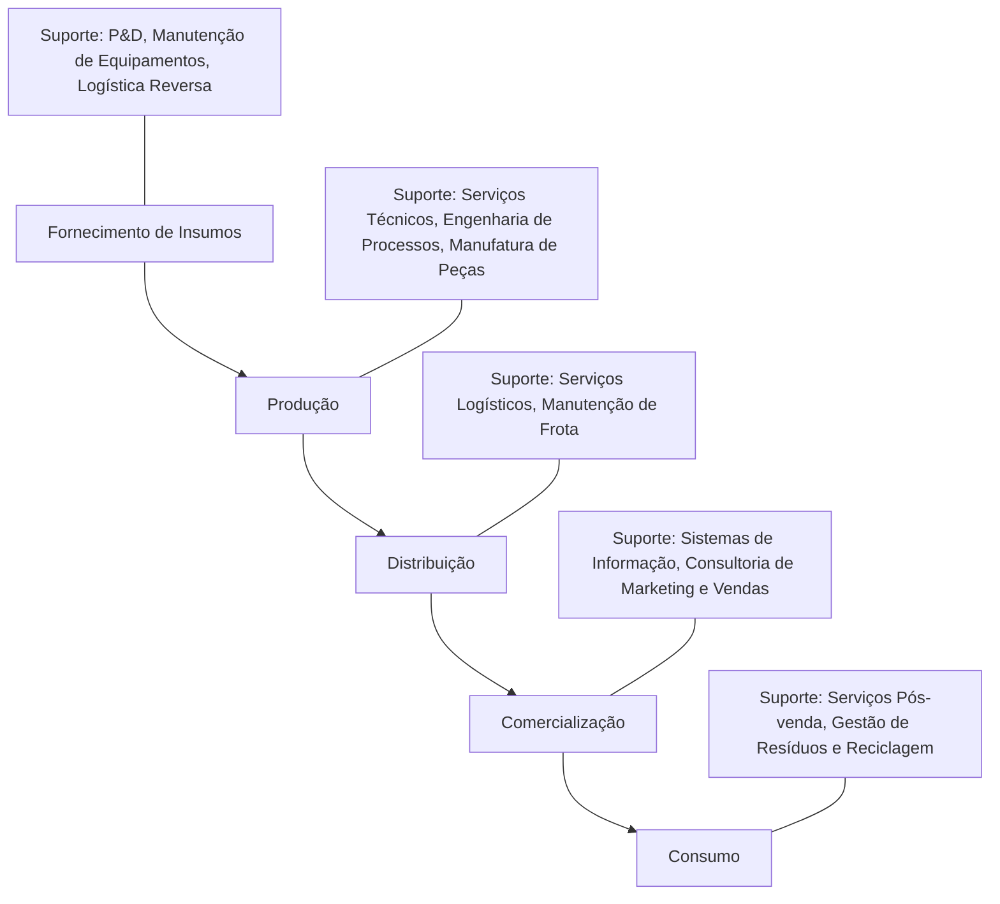

# Elos cadeia produtiva

- Tema: `SETORES PRODUTIVOS`
- Conversation ID: `67c5da59-0ae8-8002-a781-d5d342bc004a`

## Transcrição

### user

Uma cadeia produtiva possui os elos relativos àquelas atividades que caracterizam um setor produtivo. De forma genérica, identifique esses elos

### tool

**Identificando elos da cadeia produtiva**

A questão pede para identificar os elos de uma cadeia produtiva de forma genérica. Uma cadeia produtiva normalmente inclui os seguintes elos: fornecimento de insumos, produção, transformação, distribuição, comercialização, e consumo. Também podemos considerar atividades auxiliares, como gestão de resíduos. Em termos mais específicos, podemos citar: 1) logística de entrada, 2) produção, 3) logística de saída, 4) marketing e vendas, 5) serviços. Esses são os links comuns em uma cadeia produtiva genérica.

### assistant

Paulo, de forma genérica, os elos de uma cadeia produtiva podem ser identificados como:

1. **Fornecimento de insumos:** atividades relacionadas à extração ou produção das matérias-primas necessárias.
2. **Produção:** processamento ou transformação dos insumos em produtos.
3. **Distribuição:** logística e transporte que possibilitam o escoamento dos produtos.
4. **Comercialização:** atividades de venda e promoção dos produtos no mercado.
5. **Consumo:** utilização final dos produtos pelos usuários.
6. **Pós-consumo:** etapas que envolvem a destinação dos resíduos e, eventualmente, a reciclagem.

Esses elos podem variar conforme o setor, mas essa estrutura básica é comum em diferentes cadeias produtivas.

### user

Em paralelo a esses elos, existem atividades que não são específicas de uma cadeia produtiva, mas apoiam as suas atividades, como serviços técnicos, manufaturas de peças, reposição, entre outras. É possível identificar essas atividades, de acordo com o elo da cadeia ?

### tool

**Analisando atividades de apoio à cadeia produtiva**

Essas atividades de apoio, como serviços técnicos, manufatura de peças e reposição, estão conectadas aos elos específicos da cadeia produtiva. Elas podem ser identificadas com base na função que desempenham dentro de cada elo. Por exemplo, serviços técnicos podem estar associados à fase de manutenção, enquanto manufatura de peças e reposição podem ser necessárias para a continuidade da produção. Em geral, essas atividades são essenciais para garantir que a cadeia produtiva funcione de forma eficiente.

### assistant

Paulo, é possível identificar essas atividades de apoio, comumente chamadas de atividades de suporte, associadas a cada elo da cadeia produtiva. A seguir, uma divisão sintética:

1. **Fornecimento de insumos:**  
   - **Pesquisa e Desenvolvimento (P&D):** Inovação na extração ou produção das matérias-primas.  
   - **Serviços de manutenção de equipamentos:** Garantia do funcionamento dos maquinários utilizados na extração ou no processamento dos insumos.  
   - **Logística reversa:** Atividades que viabilizam o retorno e a reciclagem dos materiais, contribuindo para a sustentabilidade dos insumos.

2. **Produção:**  
   - **Serviços técnicos especializados:** Suporte técnico para a manutenção e operação dos processos produtivos.  
   - **Engenharia de processos:** Consultoria e aprimoramento dos métodos de transformação dos insumos.  
   - **Manufatura de peças de reposição:** Produção de componentes que garantem a continuidade operacional dos equipamentos.

3. **Distribuição:**  
   - **Serviços logísticos:** Planejamento e execução de operações de transporte e armazenamento, incluindo monitoramento e rastreamento de cargas.  
   - **Manutenção de frota:** Suporte para a manutenção e substituição de veículos e equipamentos de transporte.

4. **Comercialização:**  
   - **Sistemas de informação e análise de mercado:** Ferramentas que fornecem dados para estratégias comerciais e de posicionamento de mercado.  
   - **Consultoria em marketing e vendas:** Atividades que auxiliam na promoção e no alcance dos produtos aos consumidores.

5. **Consumo:**  
   - **Serviços pós-venda e assistência técnica:** Apoio para a utilização e resolução de problemas relacionados ao produto.  
   - **Gestão de resíduos e reciclagem:** Atividades que promovem a destinação adequada dos resíduos gerados no consumo.

Essa segmentação segue a ideia de que, para cada elo da cadeia produtiva, existem funções de suporte que otimizam os processos principais e contribuem para a eficiência global da cadeia. Fontes como estudos acadêmicos e publicações especializadas em gestão de cadeias produtivas e análise de valor (como os trabalhos de Porter) oferecem base para essa abordagem.

### user

É possível fazer um diagrama dessa cadeia genérica e suas respectivas atividades de suporte ?

### tool

**Criando diagrama de cadeia**

Preciso criar um diagrama que mostra as atividades genéricas da cadeia, com nós representando Fornecimento de Insumos, etc., e suas atividades de suporte. Penso em representar isso de forma textual primeiro.

O modelo seria assim:

```
            Fornecimento de Insumos
                   |  (Suporte: P&D, Manutenção de Equipamentos, Logística reversa)
                   V
                Produção
                   |  (Suporte: Serviços técnicos, Engenharia de processos, Manufatura de peças de reposição)
                   V
                Distribuição
                   |  (Suporte: Serviços logísticos, Manutenção de frota)
                   V
                Comercialização
                   |  (Suporte: Sistemas de informação e análise de mercado, Consultoria em marketing)
                   V
                Consumo
                   |  (Suporte: Serviços pós-venda, Gestão de resíduos)
```

Posso também tentar outras representações, como diagramas ASCII ou até código de diagrama em mermaid.

### assistant

Paulo, segue abaixo um diagrama sintético representando os elos da cadeia produtiva e as respectivas atividades de suporte:



Este diagrama apresenta de forma genérica o fluxo da cadeia produtiva e, para cada elo, as atividades de suporte que podem contribuir para a eficiência dos processos.
